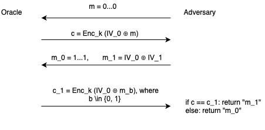

# Lista 2

## Zadanie 1.

Na potrzeby zadania zaimplementowano program, który umożliwia szyfrowanie oraz deszyfrowanie wskazanych plików na dysku za pomocą AES w różnych trybach pracy (OFB, CTR, CBC, CFB, ECB, OPENPGP, PGP).

Program może działać w trybie oracle (szyfruje wskazane pliki wyjściowe i zapisuje je pod nazwą {nazwa_pliku_wejsciowego}.enc, challenge (wybiera jeden z dwóch podanych plików i szyfruje go) oraz (dodatkowo) decrypt (deszyfruje wskazane pliki, zapisując je pod nazwą decrypted_{nazwa_pliku_wejsciowego.rozszerzenie_wejsciowe}).

Korzystamy z pyjks w celu obsługi keystore w Pythonie - jako dane wejściowe program przyjmuje ścieżkę do keystore'a, jego hasło, a także id, pod którym przechowujemy klucz używany do szyfrowania plików, oraz hasło umożliwiające odczytanie symetrycznego klucza szyfrującego/deszyfrującego.

Użycie programu (dostępne po wywołaniu polecenia python3 zad1.py -h):

```
usage: zad1.py [-h] --keystore_path KEYSTORE_PATH --keystore_pass
               KEYSTORE_PASS --key_id KEY_ID --key_pass KEY_PASS --iv IV
               --opmode {decrypt,oracle,challenge} --aes-mode
               {OFB,CTR,CBC,CFB,ECB,OPENPGP,PGP} --input_files INPUT_FILES
               [INPUT_FILES ...]

optional arguments:
  -h, --help            show this help message and exit
  --keystore_path KEYSTORE_PATH
                        Path where keystore is located
  --keystore_pass KEYSTORE_PASS
                        Password used to access keystore at a given path
  --key_id KEY_ID       Identifier under which an encryption key is stored
  --key_pass KEY_PASS   Password used to access the encryption key
  --iv IV               Value of initialization vector used during
                        encryption/decryption
  --opmode {decrypt,oracle,challenge}
                        Operation mode
  --aes-mode {OFB,CTR,CBC,CFB,ECB,OPENPGP,PGP}
                        AES encryption mode
  --input_files INPUT_FILES [INPUT_FILES ...]
                        Paths to input files
```

W repo załączono przykładowe pliki testowe, wraz z testowym keystore. Działanie programu można przetestować, wykonując dołączony skrypt zad1.sh lub używając komendy pytest (wymaga instalacji pytest).

## Zadanie 2.

Celem tego zadania było zaproponowanie ataku CPA takiego, aby po jego przeprowadzeniu za każdym razem móc prawidłowo określić, jaki szyfrogram odpowiada jakiej z wysłanych dwóch wiadomości m_0, m_1.

W tym celu zaproponowano atak przedstawiony na dołączonym diagramie:



1. Adwersarz wiadomość m = 0...0.
2. Wyrocznia zwraca C = Enc_k(IV_0)

3. Wysyłamy dwie wiadomości m_0 = 1...1, m_1 = IV_0 xor IV_1.
4. Wyrocznia zwraca C_1 = Enc_k(IV_1 xor m_b), gdzie b \in {0, 1}

Adwersarz:
- stwierdza, że jeśli C_1 == C, to szyfrogram pochodzi z wiadomości m_1 (bo wtedy C_1 = Enc_k(IV_1 xor IV_0 xor IV_1) = Enc_k(IV_0), co jest równe C = Enc_k(IV_0)
- stwierdza, że jeśli C_1 != C, to szyfrogram pochodzi z wiadomości m_0

Adwersarz jest w stanie prawidłowo określić, na bazie jakiej wiadomości powstał jaki szyfrogram dla powyższego eksperymentu z prawdopodobieństwem równym 1.

Powyższy eksperyment został zaimplementowany w Jupyter Notebook dla wygody implementacji i czytelności wykonywanych czynności.